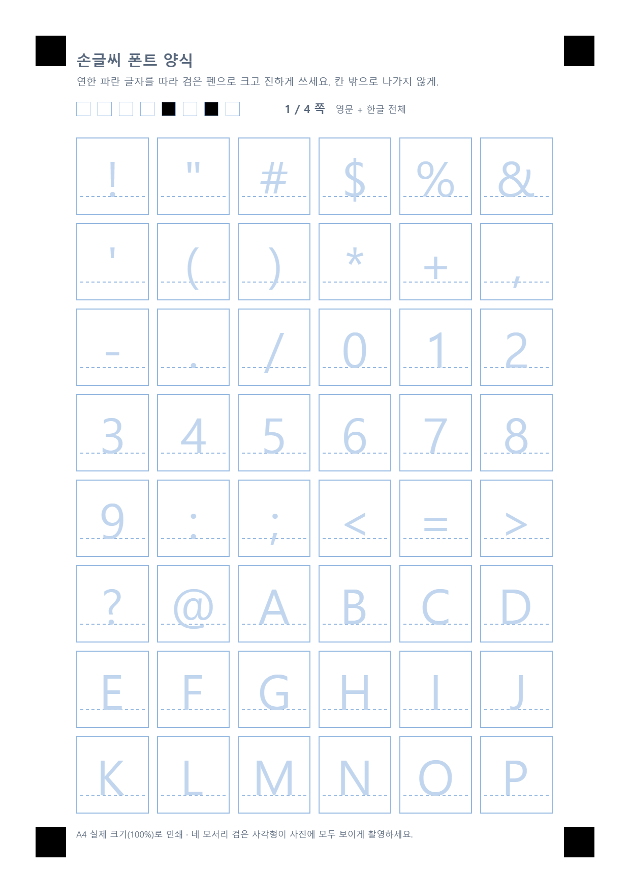
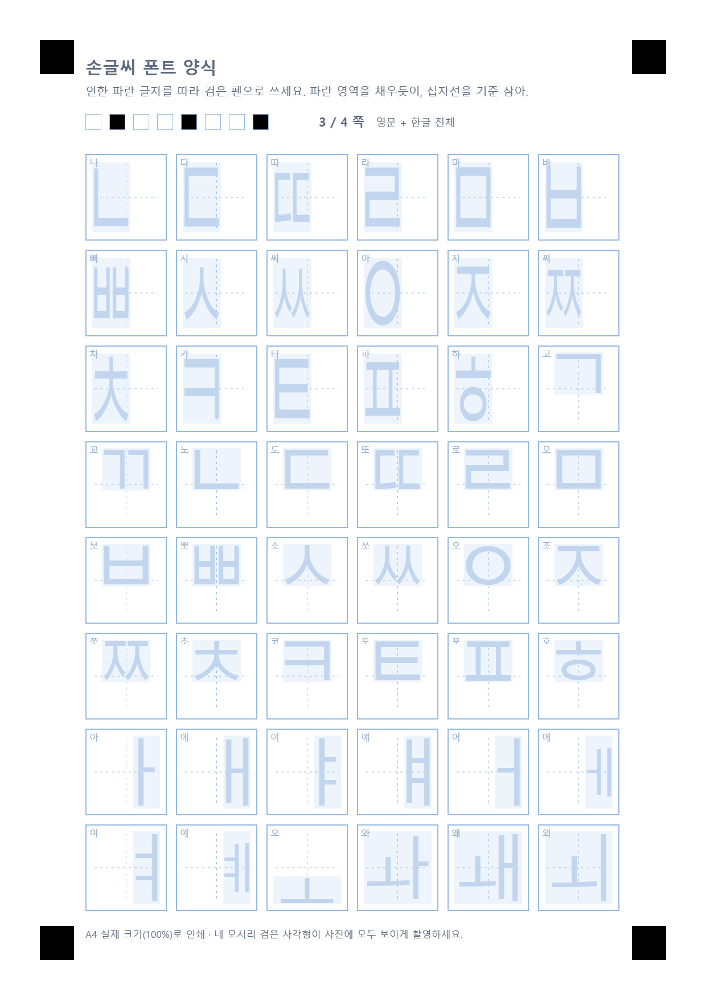
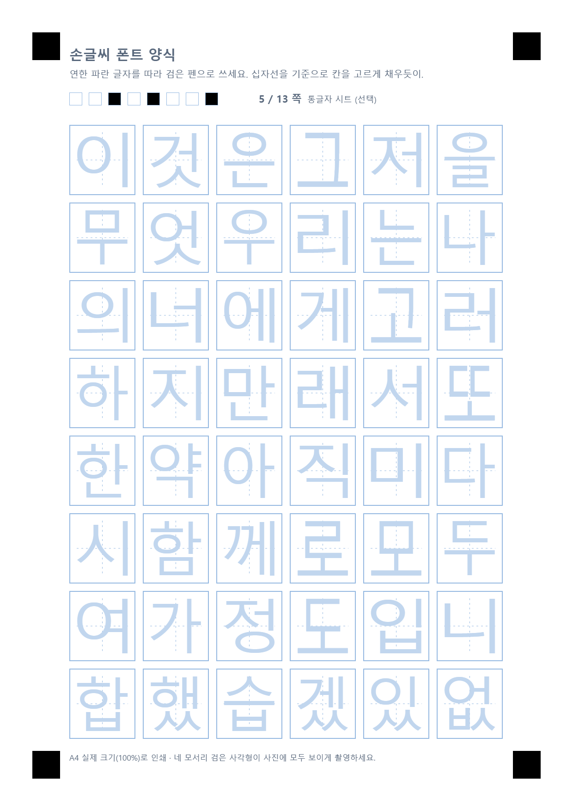
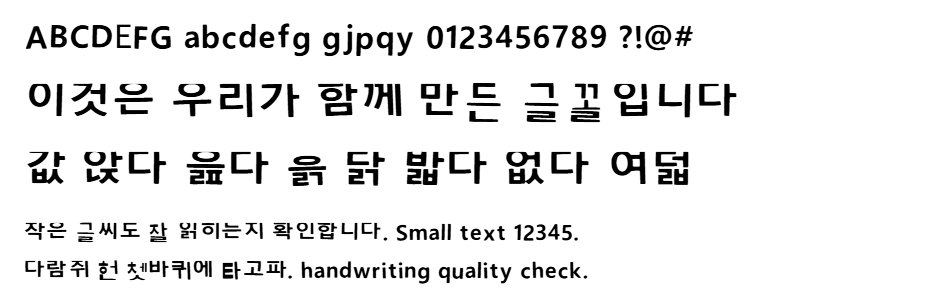

# 손글씨 폰트 만들기

종이에 쓴 손글씨를 사진으로 찍어 올리면 **윈도우에 설치할 수 있는 `.ttf` 폰트**가 됩니다.
프로그램 설치도, 회원 가입도, 파일 업로드도 없습니다. 웹페이지 하나가 전부입니다.

**👉 [바로 사용하기](https://pju0417.github.io/font/)**

| 영문 쪽 (영어 노트 4선) | 한글 자모 쪽 | 통글자 쪽 (선택) |
|---|---|---|
|  |  |  |

아래는 양식을 비스듬히 찍은 사진에서 자동으로 뽑아 만든 결과입니다.
(손글씨 대신 시스템 글꼴을 넣어 시험한 것)



---

## 어떻게 쓰나요

### 1. 양식을 인쇄합니다

만들 글자 범위를 고르고 **PDF 내려받기** 를 누릅니다.

| 범위 | 인쇄할 종이 | 결과 |
|---|---|---|
| 영문 · 숫자 · 기호 | A4 2장 (94칸) | 알파벳·숫자·문장부호 |
| 영문 + 한글 전체 | A4 4장 (180칸) | 위 + **한글 11,172자 전부** |
| ┗ 통글자 시트 (선택) | A4 최대 9장 | 자주 쓰는 423자를 통째로 — 품질 향상 |

한글을 고르면 자모 86개만 쓰면 됩니다. 프로그램이 그 자모를 조합해 `가` 부터 `힣` 까지
전부 만들어 냅니다. 완성형 2,350자를 일일이 쓰는 것보다 훨씬 적게 씁니다.

### 통글자 시트 (선택)

조합으로 만든 글자는 빠짐이 없지만 조금 기계적입니다. **자주 쓰는 글자만이라도 통째로**
써 두면 그 글자들은 조합 대신 손으로 쓴 모양이 그대로 쓰입니다.
`값` `앉` `읊` `흙` 처럼 받침이 있는 진짜 글자를 직접 쓸 수 있습니다.

한 장에 48자씩, 최대 9장(423자)까지 있습니다. **안 써도 되고, 쓴 만큼만 좋아집니다.**
나머지는 조합이 채우므로 빠지는 글자는 없습니다.

글자 목록은 실제 한국어 문장에서 **처음 나온 순서**로 뽑았습니다. 그래서 앞쪽 시트일수록
흔한 글자가 오고, 낱글자 나열이 아니라 진짜 낱말이라 쓸 때 지루하지 않습니다.
목록이 코드에 고정되어 있어 몇 장을 뽑든 앞 시트의 내용은 늘 같습니다 —
나중에 더 뽑아 이어 써도 어긋나지 않습니다.

> **인쇄 설정**: A4 · 실제 크기(100%). ‘용지에 맞춤’ 이 켜져 있으면 꺼 주세요.

### 2. 손글씨를 씁니다

- 연한 파란 글자를 따라 **검은 볼펜이나 사인펜**으로 씁니다. 연필은 너무 흐립니다.
- 칸 밖으로 나가지 않게, 옆 칸과 겹치지 않게.

**영문 칸**은 영어 노트처럼 네 줄입니다.

| 선 | 뜻 |
|---|---|
| 윗선 | `b` `d` `h` `k` `l` 과 대문자의 꼭대기 |
| 중간선 | `a` `c` `e` `o` 같은 소문자의 꼭대기 |
| **밑선(굵은 선)** | 글자가 앉는 자리 — 가장 중요합니다 |
| 아랫선 | `g` `p` `q` `y` 의 내려가는 획 끝 |

소문자 높이를 중간선에 맞춰 일정하게 쓰는 것이 폰트 품질에 특히 크게 작용합니다.
**작게 쓰면 완성된 폰트도 작게 나옵니다.**

**한글 칸**의 십자선은 음절 사각형을 4등분한 것입니다. 칸 전체가 글자 하나가 들어갈
사각형이고, 연한 파란 영역은 그 안에서 이 자모가 차지하는 자리입니다. 파란 영역을
채우듯 쓰면 조합이 예쁘게 됩니다. 칸 왼쪽 위의 작은 글자(`나`, `고`, `아` …)가
그 자모가 어떤 글자에 쓰이는지 알려 줍니다.

> **✏️ 아이패드가 있다면 인쇄하지 않아도 됩니다.**
> 양식 PDF 를 굿노트·노타빌리티·파일 앱 등에서 열고 애플펜슬로 바로 쓴 다음,
> **그 PDF 를 그대로 올리세요.** 원근 왜곡도 그림자도 없어서 사진보다 정확합니다.
> 펜은 **검은색**으로, 굵기는 넉넉하게 (형광펜이나 연한 색은 인식되지 않습니다).

### 3. 사진이나 PDF 를 올립니다

사진으로 찍는다면 종이 **네 모서리의 검은 사각형**이 모두 보이게, 그림자 없이,
위에서 내려다보며 찍습니다. 스캐너가 있으면 스캔이 가장 정확합니다.

여러 개를 한꺼번에 올려도 됩니다. 몇 쪽인지는 프로그램이 알아서 읽습니다.
같은 쪽을 여러 번 올리면 더 진하게 나온 쪽이 자동으로 선택됩니다.

### 4. 폰트를 만듭니다

**폰트 만들기** 를 누르면 몇 초 안에 완성됩니다. 미리보기로 확인하고 `.ttf` 를 내려받으세요.

### 5. 윈도우에 설치합니다

내려받은 `.ttf` 파일을 **더블클릭 → [설치]**.
한글·워드·파워포인트를 껐다 켜면 글꼴 목록에 나타납니다.

---

## 개인정보

**사진은 어디로도 전송되지 않습니다.** 이미지 처리부터 폰트 파일 생성까지 전부
브라우저 안에서 일어납니다. 서버도, 데이터베이스도, 로그도 없습니다.
인터넷 연결을 끊고 써도 동작합니다.

---

## 잘 안 될 때

| 증상 | 원인과 해결 |
|---|---|
| “네 모서리의 검은 사각형을 찾지 못했습니다” | 사각형 네 개가 다 안 나왔거나 너무 어둡습니다. 종이 전체가 나오게 다시 찍으세요. |
| “쪽 번호를 읽지 못했습니다” | 머리말의 작은 사각형 줄이 손이나 그림자에 가렸습니다. |
| 빈 칸이 많다고 나옴 | 연필이나 흐린 펜으로 썼을 가능성이 큽니다. 검은 볼펜·사인펜을 쓰세요. |
| 글자가 다른 폰트보다 작게 나옴 | 칸에 비해 작게 쓰셨습니다. 안내 글자 크기만큼 크게 다시 쓰세요. |
| 한글 일부가 빠짐 | 안 쓴 자모가 있습니다. 결과 화면에 어떤 자모인지 나옵니다. 그 칸만 다시 써서 올리세요. |
| 특정 글자만 이상함 | 그 칸만 다시 써서 사진을 올리고 폰트를 다시 만드세요. 더 진한 쪽이 선택됩니다. |
| 아이패드로 썼는데 빈 칸이라고 나옴 | 펜 색이 검은색인지, 형광펜이 아닌지 확인하세요. 획이 너무 가늘어도 걸러집니다. |

---

## 직접 배포하기

1. 이 저장소에서 **Use this template → Create a new repository**
2. 새 저장소의 **Settings → Pages → Source** 를 **GitHub Actions** 로 설정
3. `main` 에 푸시하면 자동으로 배포됩니다

또는 저장소를 내려받아 `index.html` 을 브라우저로 열어도 그대로 동작합니다.

### 외부 라이브러리

핵심 기능(양식 생성 · 이미지 처리 · 폰트 생성)에는 라이브러리를 쓰지 않습니다.
**PDF 를 읽을 때만** [pdf.js](https://mozilla.github.io/pdf.js/) (Apache 2.0, `vendor/`) 를 쓰고,
그것도 PDF 를 실제로 올렸을 때만 내려받습니다. 사진만 쓰는 사람은 1.5MB 를 건드리지 않습니다.

---

## 구조

```
index.html            화면
assets/style.css
src/
  hangul.js           한글 조합 규칙 (자모 배치 상자)
  syllables.js        통글자 시트에 쓸 자주 쓰는 음절 목록
  charset.js          어떤 글자를 쓸지 목록으로 만든다
  layout.js           양식의 좌표 — 그리는 쪽과 읽는 쪽이 공유한다
  template.js         양식을 캔버스에 그린다
  pdf.js              A4 PDF 로 묶는다 (외부 라이브러리 없음)
  pdfin.js            필기한 PDF → 쪽별 이미지 (pdf.js 를 그때만 불러온다)
  imageproc.js        사진 → 마커 검출 → 원근 보정 → 칸별 비트맵
  trace.js            비트맵 → 부드러운 윤곽선
  fontbuild.js        윤곽선 → 글리프 → 한글 음절 조립
  ttf.js              트루타입 파일 작성기 (합성 글리프 지원)
  app.js              화면 동작
```

### 설계에서 중요한 점

**좌표를 한 곳에서만 정의한다.** `layout.js` 의 칸 좌표를 양식을 그릴 때도, 사진에서
글자를 잘라낼 때도 그대로 쓴다. 사진을 네 모서리 마커로 기준 좌표계에 펴 놓으면
칸 위치를 추측할 필요가 없어진다.

**안내선은 파란 계열로 인쇄한다.** 사진에서 글자를 뽑을 때 파랑 채널을 보면 안내선은
흰 종이와 구별되지 않아 저절로 사라지고 검은 펜 자국만 남는다.

**한글은 합성 글리프로 만든다.** 자모 86개만 실제 윤곽선으로 넣고, 음절 11,172자는
“자모를 이만큼 늘려 여기에 놓아라”는 참조로만 적는다. 그래서 파일이 600KB 남짓이다.
낱낱이 그려 넣었다면 수십 MB가 됐을 것이다.

**통글자는 조합을 이긴다.** 같은 음절을 통글자 시트에서 직접 썼다면 그 글자를 쓰고,
안 썼으면 자모를 조합해 만든다. 그래서 몇 장을 쓰든 빠지는 글자가 없다.

**쪽 번호는 종이에 4비트로 인쇄된다.** 그래서 전체 쪽 수가 16을 넘으면 17쪽이 1쪽으로
읽혀 엉뚱한 글자에 붙는데 오류는 나지 않는다. `layout.js` 에서 그 경우 예외를 던진다.

**모음과 자음을 다르게 맞춘다.** 자음에게 배치 상자는 *채울 자리*라서 늘여 채운다
(세로모음 앞의 `ㄱ` 이 길쭉해지는 것은 한글 글꼴의 정상적인 모습이다).
모음에게는 *놓일 자리*다. `ㅡ` 나 `ㅣ` 를 상자에 맞춰 늘이면 획이 그대로 굵어져
막대가 되어 버린다.

---

## 개발

```bash
node tools/devserver.js 8765      # http://localhost:8765
```

검증:

```bash
node tools/selftest.js                                   # 엔진 동작 + TTF 생성
python tools/validate.py tools/selftest-out.ttf          # fontTools 로 파일 검사
```

실제 글꼴 모양을 넣어 품질을 확인:

```bash
node tools/dumpcells.js full > tools/cells.json
python tools/rendercells.py tools/cells.json tools/cells.bin
node tools/buildfromcells.js tools/cells.json tools/cells.bin out.ttf
```

브라우저에서 종단간 시험 (양식 → 원근 왜곡된 가짜 사진 → 인식 → 폰트):

```js
// 개발자 도구 콘솔에서
await import('/tools/browsertest.js'); await HFTest.run('full')
```

필요한 파이썬 꾸러미: `fonttools`, `pillow` (검증 전용, 앱 자체는 의존성 없음)

---

## 라이선스

MIT. 만들어진 폰트는 여러분의 손글씨이므로 여러분의 것입니다.
